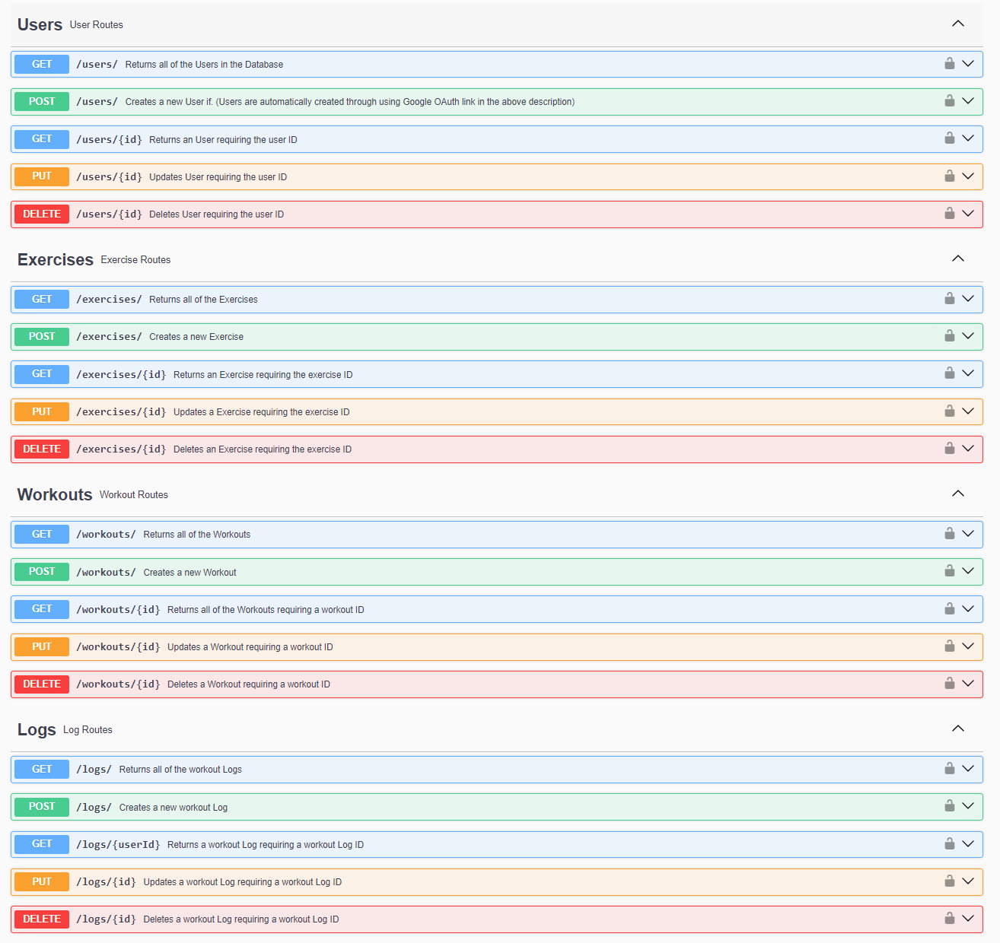

# CSE341 - Web Services Final Project: Workout Tracker 

This project was part of the CSE341 class. It was to test our knowledge in Web Backend Development. 

**The grade I got for this project was 100% with high remarks, and the total grade for the class was 101.33%**

## A Little About The Project:
This is a Node.js Express.js project that is deployed on render. It connects to a MongoDB API. This program is all backend, meaning there is nothing to look at other than the Swagger Documentation that can be located here: 

* [https://cse341-final-project-workout-tracker.onrender.com/api-docs/](https://cse341-final-project-workout-tracker.onrender.com/api-docs/) (This link may take a minute to load.)

This program is using authorization from ***Google OAuth 2***, meaning that to be authenticated, one must connect follow a link in the API Documentation to create a user through OAuth, and then once added, then can be authorized through the Authorized button in the Swagger documentation. This will allow access to the protected routes (mainly the POST, PUT, and DELETE routes).

<!-- Swagger Documentation Image -->

This program also has validation integrated into it, so if there is a ***POST*** or ***PUT*** request sent, it will check if the JSON is formatted correctly and is consistent with what is required. If it passes the validation, it will move onto the controller function to process the request. If not, then it will display an error with what element is wrong in the request.

Inside this program are also ***Unit Tests*** for each of the routes in the Swagger API Documentation. Each test checks whether the route works correctly and returns the correct response. There are a few mocks being used in it, but other than that, it tests directly to the database by creating, updating, and deleting the users, so that it does not add unnecessary database entries. There are 19 tests total, and they all pass.

Here is the ***Demo Video*** that I submitted to show off the project. It goes into detail about the project and some of the challenges that I faced: 
* [YouTube: CSE 341 - Final Project - Workout Tracker](https://www.youtube.com/watch?v=doYIXvnF7fU&list=PLPE1QSGfgkqzt2ZOL1YVs88NRuCPuE96I&index=11)

## Resources Used:
* Node.js
* Express.js
* ESLint
* Google OAuth 2 - *Authentication*
* Swagger - *API Documentation*
* MongoDB - *Database*
* Jest - *Unit Tests*
* Visual Studio Code
* ChatGPT
* Render - *Website Deployment*
* RESTful API

And some other dependencies and resources. They can be seen in the Package.json file.